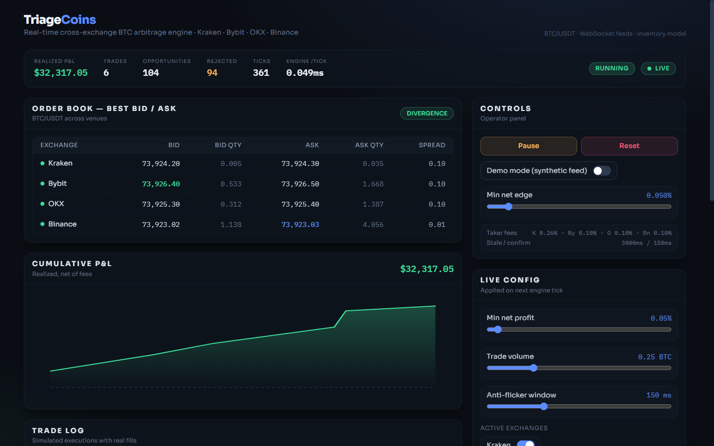
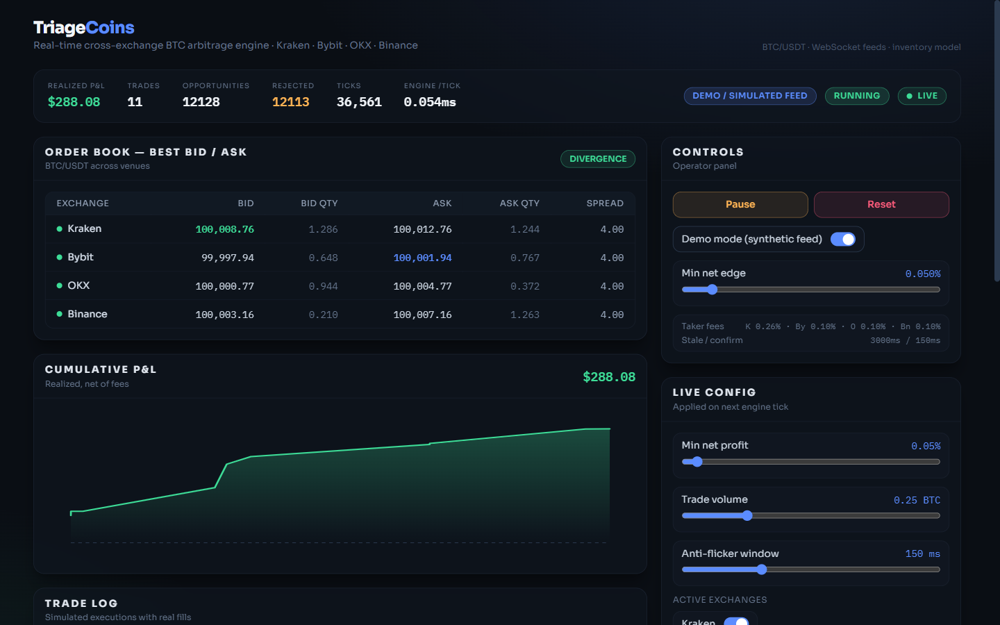

# Arb Pulse

**Detección y simulación de arbitraje de Bitcoin en tiempo real** entre Kraken, Bybit, OKX y Binance.

Monolito Node.js + TypeScript: API REST, stream SSE y dashboard React servidos desde **un solo proceso y una sola URL**. Escucha libros de órdenes por WebSocket, calcula rentabilidad **neta de fees y slippage VWAP**, y simula ejecución con inventario pre-posicionado. No mueve fondos reales.

---

## Descripción

Arb Pulse compara **BTC/USDT** en cuatro exchanges, camina el order book nivel a nivel, descarta oportunidades que no pagan comisiones taker, y —si pasan anti-flicker y riesgo— simula compra y venta en paralelo actualizando wallets virtuales por venue.

En mercado **real** verás sobre todo oportunidades `rejected · fees` (comportamiento esperado en mercados eficientes). El **modo demo** inyecta divergencias sintéticas con badge visible para demostrar el pipeline completo: detección → riesgo → ejecución → P&L → rebalanceo.

---

## Capturas de pantalla

### Feed en vivo (mercado real)

Badge **LIVE**, price matrix con cuatro venues, oportunidades rechazadas por fees y P&L en cero — el filtro económico es estricto.



### Modo demo (feed sintético)

Badge **Demo / Simulated Feed**, trades simulados y curva de P&L — útil para presentaciones sin confundir datos sintéticos con mercado real.



Capturas completas (scroll): [`dashboard-live.png`](docs/screenshots/dashboard-live.png) · [`dashboard-demo.png`](docs/screenshots/dashboard-demo.png)

---

## Stack tecnológico

| Capa        | Tecnología                                      |
|-------------|-------------------------------------------------|
| Runtime     | Node.js 20+, TypeScript (strict), `tsx`         |
| HTTP        | Express — REST + SSE + Swagger UI (`/api-docs`) |
| Feeds       | WebSocket nativo (`ws`) — APIs públicas         |
| Frontend    | React 18, Vite, Tailwind CSS v3                 |
| Estado      | In-memory (sin base de datos)                   |
| Deploy      | [Fly.io](https://fly.io) — Docker multi-stage (`Dockerfile` + `fly.toml`) |

No se requieren API keys: los feeds de mercado son públicos.

---

## Instalación

### Requisitos

- [Node.js](https://nodejs.org/) **20+**
- [Git](https://git-scm.com/)

### Pasos

```bash
git clone https://github.com/mauricioabh/arbpulse.git
cd arbpulse

# Dependencias (raíz + frontend)
npm install
npm --prefix web install

# Variables opcionales (defaults en .env.example)
cp .env.example .env   # Linux / macOS
# copy .env.example .env   # Windows

# Build del frontend
npm run build
```

### Arrancar

**Producción local** (un proceso, recomendado para probar el dashboard):

```bash
npm start
# → http://localhost:8080
```

**Desarrollo** (backend + Vite con hot reload):

```bash
npm run dev          # Backend :8080
npm run dev:web      # Frontend :5173 (proxy /api → :8080)
```

**Modo demo** (presentación con actividad visible en segundos):

```powershell
# Windows PowerShell
$env:DEMO_MODE="true"; npm start
```

```bash
# Linux / macOS
DEMO_MODE=true npm start
```

### Verificar

1. Abre `http://localhost:8080` — el badge debe mostrar **LIVE** (o **Demo / Simulated Feed** si usaste demo).
2. La price matrix debe listar los cuatro exchanges con bid/ask numéricos.
3. Healthcheck: `GET http://localhost:8080/api/health` → `{ "success": true, "data": { "status": "ok" } }`.

### Calidad de código

```bash
npm run typecheck    # TypeScript backend + frontend
npm test             # Tests unitarios (node:test)
npm run build        # Frontend Vite → web/dist
```

Los PRs hacia `dev` o `main` deben pasar **GitHub Actions** (`CI / quality`: typecheck, test, build).

---

## Por qué existe y qué problema resuelve

En mercados líquidos, las divergencias de precio entre exchanges suelen **desaparecer en neto** en cuanto sumas comisiones taker y el costo real de cruzar el libro. Muchas demos de arbitraje muestran spreads brutos o asumen un slippage fijo del 0,1 %, y eso infla resultados.

Arb Pulse prioriza tres cosas:

1. **Precisión económica** — VWAP nivel a nivel, fees taker por exchange, profit neto sin doble conteo de slippage.
2. **Modelo operativo creíble** — inventario USDT + BTC en cada exchange; no se “transfiere BTC por trade” (eso tarda decenas de minutos on-chain).
3. **Honestidad en vivo** — en feed real verás sobre todo rechazos por fees; el modo demo inyecta divergencias sintéticas con badge visible para demostrar el pipeline completo.

---

## Decisiones de diseño que importan

### Inventario pre-posicionado (no transferencia por operación)

El arbitraje cross-exchange real asume que **ya tienes BTC y USDT en cada venue**. En cada oportunidad: compras BTC donde está barato (gastas USDT) y vendes BTC donde está caro (recibes USDT), **en paralelo**, sin mover monedas entre exchanges en esa operación.

El inventario deriva con el tiempo. Un **Rebalancer** corrige desbalances cuando el ratio de BTC o USDT cae por debajo de umbrales. El **withdrawal fee de red solo se aplica en rebalanceo**, amortizado sobre muchos trades — no en cada arbitraje simulado. Cobrar withdrawal por trade es un error común en simuladores simplificados.

### Mismo par en todos lados: BTC/USDT

Comparar `BTC/USDT` con `BTC/USD` mezcla basis de stablecoin y genera “arbitrajes” que no son ejecutables de forma consistente. Aquí los conectores normalizan **BTC/USDT**.

### Slippage con VWAP, no un porcentaje fijo

El volumen objetivo recorre el libro bid/ask nivel a nivel (`src/domain/services/vwap.ts`). El profit neto usa los VWAP de compra y venta; el slippage ya está dentro de esos precios:

```
profit = sellVwap × vol × (1 − feeSell) − buyVwap × vol × (1 + feeBuy)
```

### Fees taker reales (el arbitraje siempre cruza el spread)

| Exchange | Taker (aprox.) |
|----------|----------------|
| Kraken   | 0,26 %         |
| Bybit    | 0,10 %         |
| OKX      | 0,10 %         |
| Binance  | 0,10 %         |

Consecuencia esperada en feed **real**: la mayoría de divergencias brutas salen **rejected · fees** en el log. Eso es comportamiento correcto, no un bug.

### Robustez en el hot path

- **One trade per tick** — si varios pares confirman en el mismo tick, solo se ejecuta el de mayor `netProfit` (desempate por `netProfitPct` y par lexicográfico).
- **Staleness** — quotes más viejos que `STALE_MS` no disparan ejecución.
- **Anti-flicker** — la divergencia debe persistir `FLICKER_CONFIRM_MS` antes de actuar (filtra artefactos de latencia).
- **Partial fills** — volumen limitado por profundidad del libro e inventario de wallet.
- **Circuit breaker** — tras N pérdidas consecutivas, pausa con cooldown.
- **Latency drift** — entre detección y ejecución simulada se aplica deslizamiento adverso (P&L realista, no best-case).

### Modo demo claramente etiquetado

Los arbitrajes netos positivos son raros en vivo. Con `DEMO_MODE=true` un feed sintético inyecta divergencias para mostrar detección → riesgo → ejecución → P&L → rebalanceo. El dashboard muestra el badge **Demo / Simulated Feed**; nunca debe confundirse con mercado real.

Opcionalmente, `RECORD_FEED=true` graba ticks en `data/*.ndjson` (ignorados por git; pueden pesar mucho).

---

## Arquitectura

```
Exchanges (WS: Kraken v2, Bybit v5, OKX v5, Binance depth10@100ms + REST fallback)
   │  libros normalizados (snapshot + deltas, staleness)
   ▼
OrderBookManager ── mejor bid/ask y frescura por venue
   ▼
ArbitrageEngine ── matriz N×N · VWAP · profit neto · scoring · anti-flicker
   ▼
RiskManager ── umbral mínimo · circuit breaker · pause/resume
   ▼
ExecutionSimulator ── partial fills · latency drift · wallets
   ▼                         ▲
Rebalancer ── corrección de inventario (withdrawal fee en rebalanceo)
   ▼
Store (in-memory) + FeedRecorder (NDJSON opcional)
   ▼
API REST + SSE ──► Dashboard React
```

**SSE para el dashboard** — el flujo servidor→cliente es unidireccional; SSE reconecta sobre HTTP sin un segundo WebSocket hacia el navegador.

**Monolito en Fly.io** — el motor necesita conexiones WS persistentes y estado en memoria continuo; no encaja en serverless efímero. Un proceso Node sirve `/api`, `/api/stream` y los estáticos de `web/dist`.

El dominio (`src/domain/`) no importa infraestructura ni HTTP; los casos de uso en `application/` orquestan; `composition/bootstrap.ts` cablea adaptadores concretos.


---

## Estructura del repositorio

```
src/
  index.ts                    Express + bootstrap + estáticos web/dist
  composition/                bootstrap.ts, application-service.ts (wiring)
  domain/
    entities/                 OrderBook, Opportunity, Trade, Wallet, …
    ports/                    MarketDataFeed, IQuoteBook, TradingPolicy, …
    services/                 vwap, pricing, ArbitrageEngine
  application/
    use-cases/                ProcessOrderBookUpdate, ExecuteArbitrage, …
  infrastructure/
    exchanges/                WS Kraken / Bybit / OKX / Binance
    demo/                     SyntheticFeed, FeedRecorder (NDJSON)
    state/                    Store, WalletBook, OrderBookManager
    config/                   config.ts, runtime.ts (único lector de env)
    simulation/               ExecutionSimulator, RiskManager
    rebalancing/              Rebalancer
    logging/                  logger
  interfaces/
    http/                     REST → ApplicationService, OpenAPI spec (`openapi.ts`)
    sse/                      SSE hub
  test-support/               fakes + FakeMarketDataFeed (tests)
web/
  src/                  Dashboard (StatsBar, PriceMatrix, PnL, TradeLog, Wallets, Controls, ConfigPanel)
Dockerfile              Imagen Node 20 (build Vite + tsx en prod)
fly.toml                Región, env vars y healthcheck Fly.io
.env.example            Variables documentadas (sin secretos)
```

---

## Dashboard

El frontend consume solo la API del mismo origen (en dev, Vite hace proxy de `/api` al backend).

| Panel | Contenido |
|-------|-----------|
| **Stats bar** | P&L realizado, trades, rechazos, ticks, ms/tick del motor, estado LIVE/OFFLINE, circuit breaker |
| **Price matrix** | Mejor bid/ask por exchange y frescura |
| **P&L chart** | Serie temporal de beneficio simulado |
| **Trade log** | Ejecuciones y rechazos con motivo |
| **Wallets** | USDT y BTC por venue + rebalanceos recientes |
| **Opportunity feed** | Oportunidades detectadas (ejecutadas o no) |
| **Controls** | Pausa/reanudar, reset, demo on/off, umbral de edge mínimo, resumen de fees y stale/confirm |
| **Live config** | Min net profit, volumen por trade, ventana anti-flicker, activar/desactivar exchanges por venue |


---

## Variables de entorno

Copia `.env.example` a `.env` si quieres overrides locales. Todas son opcionales.

| Variable | Default | Descripción |
|----------|---------|-------------|
| `PORT` | `8080` | Puerto HTTP |
| `DEMO_MODE` | `false` | Feed sintético con divergencias inyectadas |
| `MIN_NET_PROFIT_PCT` | `0.0005` | Edge neto mínimo para ejecutar (0,05 %) |
| `MAX_TRADE_BTC` | `0.25` | Volumen máximo por trade simulado |
| `STALE_MS` | `3000` | Ignorar quotes más viejos que esto |
| `FLICKER_CONFIRM_MS` | `150` | Persistencia mínima antes de ejecutar |
| `LATENCY_MS` | `120` | Latencia simulada detección → ejecución |
| `LATENCY_SLIPPAGE_BPS` | `2` | Drift adverso de precio durante la latencia |
| `CIRCUIT_BREAKER_LOSSES` | `5` | Pérdidas seguidas antes de pausar |
| `CIRCUIT_BREAKER_COOLDOWN_MS` | `15000` | Cooldown del circuit breaker |
| `INITIAL_USDT` | `50000` | USDT inicial por exchange |
| `INITIAL_BTC` | `0.5` | BTC inicial por exchange |
| `RECORD_FEED` | `false` | Graba ticks en `data/*.ndjson` |

Umbral, volumen máximo, anti-flicker, exchanges activos y demo también se cambian en vivo desde el dashboard (`Controls` + `Live config`). La grabación NDJSON (`RECORD_FEED` / `POST /api/control/record`) puede activarse en caliente vía API.

---

## API HTTP

Respuestas REST siguen la forma `{ success, data?, error? }`.

| Método | Ruta | Descripción |
|--------|------|-------------|
| `GET` | `/api/health` | Healthcheck (Fly.io) |
| `GET` | `/api/state` | Snapshot completo del estado |
| `GET` | `/api/stream` | **SSE** — snapshots en tiempo real |
| `GET` | `/api/config` | Configuración del motor (fees, umbrales, exchanges activos) |
| `PATCH` | `/api/config` | Actualización parcial: `{ minNetProfitPct?, maxTradeBtc?, flickerConfirmMs?, activeExchanges? }` |
| `POST` | `/api/control/pause` | Pausar motor |
| `POST` | `/api/control/resume` | Reanudar |
| `POST` | `/api/control/reset` | Reiniciar estado simulado |
| `POST` | `/api/control/demo` | `{ "enabled": boolean }` |
| `POST` | `/api/control/record` | `{ "enabled": boolean }` — grabación NDJSON en `data/` |
| `POST` | `/api/control/threshold` | `{ "pct": number }` (atajo de `PATCH /api/config`) |
| `POST` | `/api/control/max-trade` | `{ "btc": number }` (atajo de `PATCH /api/config`) |
| `GET` | `/api-docs` | **Scalar** — documentación interactiva OpenAPI 3.0 |

Contrato generado desde Zod (`src/interfaces/http/schemas/`) con `@asteasolutions/zod-to-openapi`; registro de rutas en `src/interfaces/http/openapi.ts`.

---

## Deploy en Fly.io

El repo incluye `Dockerfile` (multi-stage: build Vite + runtime Node), `fly.toml` y el workflow `.github/workflows/fly-deploy.yml`.

1. Instala [flyctl](https://fly.io/docs/flyctl/install/) e inicia sesión: `fly auth login`.
2. Desde la raíz del repo: `fly launch` (primera vez) o `fly deploy`.
3. **Región primaria:** `sin` (Singapore) — menor latencia a matching engines de Binance, Bybit y OKX.
4. Fly expone el servicio en el puerto interno **8080** con healthcheck `GET /api/health`.
5. Variables de entorno: opcionales; `fly.toml` incluye defaults razonables (`STALE_MS`, inventario inicial, etc.).
6. **CI/CD:** cada push a `main` dispara deploy automático vía GitHub Actions (`fly-deploy.yml`; requiere secret `FLY_API_TOKEN`). Los PRs pasan `CI / quality` (typecheck, test, build) sin desplegar.
7. Abre la URL pública: badge **LIVE**, cuatro venues en la price matrix, y —en mercado real— sobre todo oportunidades rechazadas por fees (esperado).

> Producción usa **Fly.io**. `railway.json` es un artefacto legacy del deploy anterior; no lo uses.

Para una demo con actividad visible en pocos segundos, define `DEMO_MODE=true` en Fly (`fly secrets set` / `[env]` en `fly.toml`) o actívalo desde Controls.

---

## Qué esperar en producción con feed real

- Conexión estable a los cuatro feeds (Binance usa REST polling si el WS cae).
- Motor procesando ticks en sub-milisegundo medio (visible como **Engine /tick**).
- Pocas o ninguna ejecución rentable en neto; muchos eventos `rejected · fees`.
- Wallets y rebalanceos reflejando el modelo de inventario, no transferencias por trade.

Eso no indica que el bot “no funcione”: indica que el filtro económico es estricto.

---

## Roadmap

- Arbitraje triangular (misma exchange, otra ruta de precios).
- Replay determinista desde NDJSON grabado (hoy: recorder; loader en evolución).

---

## Production practices

- **Pre-commit:** Husky runs lint-staged (`eslint --fix`, `prettier --write`) on staged `*.ts` / `*.tsx` in `src/` and `web/src/`.
- **API contracts:** Zod schemas per REST endpoint → OpenAPI via `@asteasolutions/zod-to-openapi` → Scalar UI at `/api-docs`. Request bodies validated with Zod in route handlers.
- **Observability:** `@sentry/node` captures REST, WebSocket feed, and SSE errors (always on when `SENTRY_DSN` is set); `pino` JSON logs with `correlationId` (from `x-request-id` or per book tick); OpenTelemetry spans (`ws.message` → `orderbook.process` → `arbitrage.evaluate` → `sse.broadcast`) export to Sentry via `@sentry/opentelemetry` **only when `SENTRY_TRACING` is enabled** (default off, so 24/7 operation stays within the free-tier span quota). With tracing off the tracer is a no-op — no spans are created or exported — but errors are still captured. Dev probe: `GET /api/debug/sentry`; verify with `npm run test:observability`.
- **Rate limiting & cache:** Upstash sliding-window limits per IP on read/write/SSE routes (`429` + `Retry-After`). Latest `StateSnapshot` cached in Redis (~1s TTL) for `GET /api/state` and refreshed on SSE broadcast. Set `UPSTASH_REDIS_REST_URL` and `UPSTASH_REDIS_REST_TOKEN`. Verify with `npm run test:rate-limit`.
- **CI:** GitHub Actions quality pipeline (typecheck, unit tests, build); Playwright smoke on PRs — dashboard loads and SSE connects (`npm run test:e2e`, workflow `e2e.yml`, `DEMO_MODE=true` in CI).
- **Security scanning:** CodeQL (`.github/workflows/codeql.yml`); Dependabot for npm (root + `web/`) and GitHub Actions.

---

## Licencia

MIT — ver archivo `LICENSE` cuando se añada al repositorio.

---

## Créditos y contexto

Proyecto de detección y simulación educativa/experimental de arbitraje BTC. No es asesoramiento financiero ni ejecución real de órdenes. Los fees y umbrales reflejan configuración documentada en código; verifica siempre las tablas oficiales de cada exchange antes de operar con capital real.
